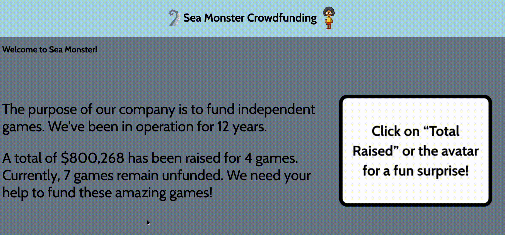

# WEB102 Prework - *Ruth's Sea Monster*

Submitted by: **Ruth Assefa**

**Ruth's Sea Monster** is a website for the company Sea Monster Crowdfunding that displays information about the games they have funded.

Time spent: **6** hours spent in total

## Required Features

The following **required** functionality is completed:

* [✅] The introduction section explains the background of the company and how many games remain unfunded.
* [✅] The Stats section includes information about the total contributions and dollars raised as well as the top two most funded games.
* [✅] The Our Games section initially displays all games funded by Sea Monster Crowdfunding
* [✅] The Our Games section has three buttons that allow the user to display only unfunded games, only funded games, or all games.

The following **optional** features are implemented:

* [✅] The search bar allows for users to search up a game that is currently being shown
    - Ex: If a user clicks on the "Show Unfunded Only" button, then they can search up the name of an unfunded game using the search bar. The same applies to the other two buttons
* [✅] Users can click on either the text "Total Raised" or the avatar in the navigation bar for a fun surprise

## Video Walkthrough

Here's a walkthrough of implemented features:

- Opening Page: 
- - 

- Our Games Page: 
- - 

<!-- Replace this with whatever GIF tool you used! -->
GIF created with ...  
<!-- Recommended tools:
[Kap](https://getkap.co/) for macOS
[ScreenToGif](https://www.screentogif.com/) for Windows
[peek](https://github.com/phw/peek) for Linux. -->

## Notes

Describe any challenges encountered while building the app:
    - A challenge I experienced was trying to remember certain Javascript skills/functions such as template literals, ternary operators, etc. But the explanations on each document were extremely helpful with getting a better understanding.

## License

    Copyright [2025] [Ruth Assefa]

    Licensed under the Apache License, Version 2.0 (the "License");
    you may not use this file except in compliance with the License.
    You may obtain a copy of the License at

        http://www.apache.org/licenses/LICENSE-2.0

    Unless required by applicable law or agreed to in writing, software
    distributed under the License is distributed on an "AS IS" BASIS,
    WITHOUT WARRANTIES OR CONDITIONS OF ANY KIND, either express or implied.
    See the License for the specific language governing permissions and
    limitations under the License.
